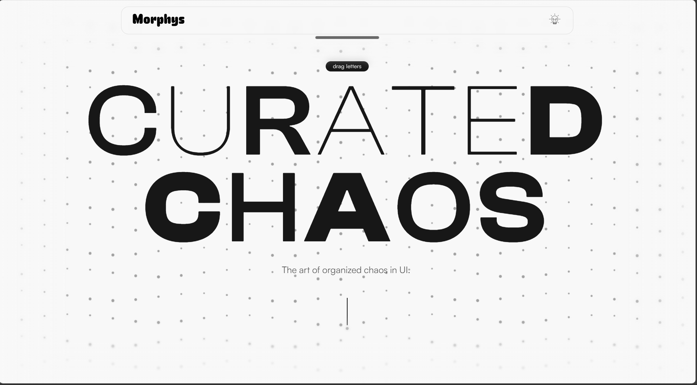

# Morphys - The Future of UI Design

Morphys is a cutting-edge web application designed to showcase and explore modern UI design trends through an immersive, interactive experience. Built with **Next.js**, **Framer Motion**, and **Tailwind CSS**, it features a fluid "Infinite Canvas" interface that allows users to navigate spatially between different design paradigms.

 *[Note: Add a hero screenshot here if available]*

## 🌟 Project Overview

Morphys serves as both a portfolio and a technical demonstration of advanced frontend engineering. It moves away from traditional page-based routing to a spatial, canvas-based navigation system where users can "fly" between different details of design styles like **Glassmorphism**, **Neo-Brutalism**, and **Minimalism**.

## 🚀 Key Features

### Core Experience
*   **Infinite Canvas Navigation:** A unified 2D plane where all style details live. Users can drag to pan or "fly" to specific sections.
*   **Diagonal 3D Carousel:** A unique, physics-based entry point that lets users swipe through design styles with a distinct diagonal parallax effect.
*   **Seamless Transitions:** zero-latency transitions between the carousel and the deep-dive canvas view.

### Advanced Interactivity
*   **Smart MiniMap:** A context-aware navigation aid that appears only when necessary (e.g., when exploring far from the center on mobile).
*   **Physics-Based Animations:** Heavy use of `react-spring` and Framer Motion springs to give UI elements weight and momentum.
*   **Responsive Design:** A completely bespoke mobile experience that feels native, with specific gestures and "sheet-like" behavior for details.

### Visual Polish
*   **Glassmorphism System:** A consistent, high-performance frosted glass effect system used throughout the UI.
*   **Progressive Blurs:** sophisticated CSS masking to create seamless edges and "fading" effects without hard lines.
*   **Dynamic Lighting:** UI elements that react to "active" states with glowing borders and ambient lighting.

## 📅 Changelog & Development History

### ✅ Recent Updates (The Journey So Far)

*   **Mobile Experience Overhaul:**
    *   Fixed "jumping" artifacts during image enlargement transitions.
    *   Implemented a unified "Arrival" animation for mobile cards to match the carousel entry.
    *   Optimized MiniMap visibility logic to reduce noise (distance threshold increased to 80 units).
    *   Removed dark "tints" from glass containers to ensure a pure, crystalline look on mobile.
*   **Desktop Refinements:**
    *   Replaced complex shared-element transitions on desktop with a smoother "Fade out -> Zoom in" flow for closing details.
    *   Connected the "Back" button on desktop to a seamless "re-arrival" animation in the carousel.
*   **Infinite Canvas:**
    *   Implemented the core 2D spatial layout engine.
    *   Added keyboard navigation (Arrow keys).
    *   Added "Snap to Center" functionality for nearby sections.

### 🚧 Present Focus
*   Tweaking physics constants for the perfect "weight" in drag interactions.
*   Ensuring 60fps performance on mobile devices during heavy blur rendering.
*   Fine-tuning the "Arrival" and "Departure" sequences to distinguish between "Exploration" and "Detail View".

### 🔮 Future Roadmap
*   **New Design Styles:** Introducing Claymorphism and Holographic UI examples.
*   **3D Elements:** Integrating Three.js/React Three Fiber for floating background elements.
*   **Theme Editor:** Allowing users to tweak the "Glass" properties (blur amount, opacity) in real-time.
*   **Accessibility Audit:** Full ARIA support and screen reader optimizations for the canvas view.

## 🛠️ Stack

*   **Framework:** [Next.js 15](https://nextjs.org/) (App Router)
*   **Styling:** [Tailwind CSS](https://tailwindcss.com/)
*   **Animation:** [Framer Motion](https://www.framer.com/motion/)
*   **Gestures:** React UseGesture (if applicable) / Native Pointer Events
*   **Language:** TypeScript

## 🏃‍♂️ Running Locally

1.  Clone the repository:
    ```bash
    git clone https://github.com/Jaswanth-Marni/Morphys.git
    ```
2.  Install dependencies:
    ```bash
    npm install
    ```
3.  Run the development server:
    ```bash
    npm run dev
    ```
4.  Open [http://localhost:3000](http://localhost:3000)

## 📄 License

This project is open source and available under the [MIT License](LICENSE).

---
*Created by [Jaswanth Marni](https://github.com/Jaswanth-Marni)*
